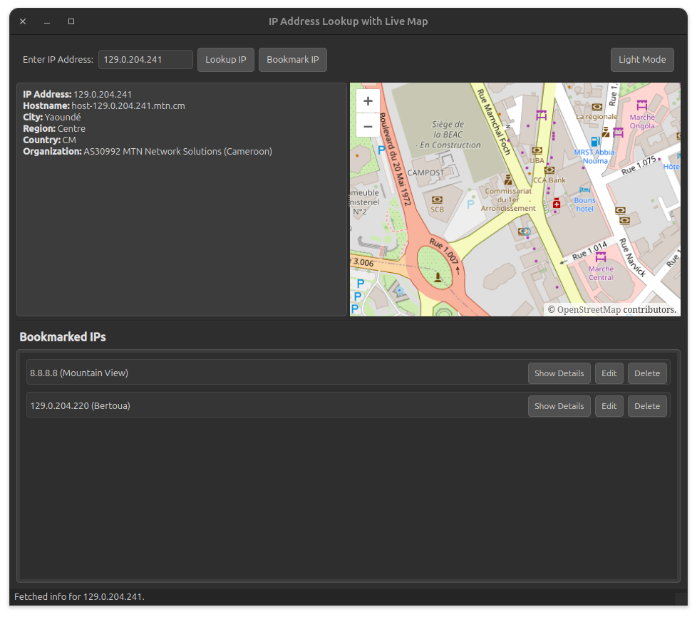

# 🛰️ IP Lookup App with Bookmarks and Live Map

A modern desktop application for looking up IP address information, visualizing locations on a live map, and managing bookmarks.  
Built with Python, PySide6 (Qt for Python), and OpenLayers for map rendering.



---

## ✨ Features

- 🔍 **IP Lookup:** Enter any IPv4 or IPv6 address to fetch detailed information (location, organization, hostname, etc.) using the [ipinfo.io](https://ipinfo.io/) API.
- 🗺️ **Live Map:** Instantly view the geolocation of the IP address on an interactive map (OpenLayers, embedded in-app).
- ⭐ **Bookmarking:** Save IP addresses and their details for future reference.
- ✏️ **Edit Bookmarks:** Update the IP address of any bookmark (with live validation and info refresh).
- 🗑️ **Delete Bookmarks:** Remove bookmarks you no longer need.
- 📋 **Show Details:** Instantly display full details and map for any bookmarked IP.
- 💾 **Persistent Storage:** Bookmarks are saved to `ip_bookmarks.json` in the app directory.
- ⚡ **Responsive UI:** All network operations run in a background thread to keep the interface responsive.
- 🌗 **Light/Dark Theme:** Toggle between light and dark UI themes.
- 🛡️ **Error Handling:** Graceful handling of invalid IPs, network errors, and duplicate bookmarks.

---

## 🛠️ Installation

### Prerequisites

- 🐍 Python 3.7+
- [pip](https://pip.pypa.io/en/stable/)

### Install Dependencies

```sh
pip install -r requirements.txt
```

> **Note:**  
> You must have [PySide6](https://doc.qt.io/qtforpython/) installed with WebEngine support.  
> If you encounter issues with the map view, ensure your Python environment supports `PySide6.QtWebEngineWidgets`.

---

## 🚀 Usage

1. **Run the Application:**

    ```sh
    python ip_lookup_app_themed_map.py
    ```

2. **Lookup an IP:**
    - Enter an IP address (e.g., `8.8.8.8` or `2001:4860:4860::8888`) in the input field.
    - Click "Lookup IP" or press Enter.
    - The app will display IP details and show the location on the map.

3. **Bookmark an IP:**
    - After a successful lookup, click "Bookmark IP" to save it.

4. **Manage Bookmarks:**
    - View all saved IPs in the "Bookmarked IPs" section.
    - Use "Show Details" to display info and map in the main panel.
    - Use "Edit" to change the IP address (the app will fetch and update details).
    - Use "Delete" to remove a bookmark.

5. **Switch Theme:**
    - Click "Toggle Theme" to switch between light and dark modes.

---

## 📁 File Structure

```
ip_lookup_app_themed_map.py          # Main application code
README.md                            # This file
requirements.txt                     # Python dependencies
demo/
    img-1.png
ip_bookmarks.json                    # (Created at runtime) Stores bookmarks
```

---

## 📝 Notes

- 🌐 The app uses the free [ipinfo.io](https://ipinfo.io/) API endpoint. For heavy use or advanced features, consider registering for an API key.
- 💾 Bookmarks are stored locally in `ip_bookmarks.json` (created automatically).
- ⚡ All network requests are performed in a background thread for a smooth user experience.
- 🗺️ The map is rendered using OpenLayers via an embedded web view (`QWebEngineView`).

---

## 📄 License

This project is provided for educational and personal use.

---

## 🙏 Acknowledgements

- [ipinfo.io](https://ipinfo.io/) for the IP geolocation API.
- [PySide6](https://doc.qt.io/qtforpython/) for the Qt for Python bindings.
- [OpenLayers](https://openlayers.org/) for the interactive map